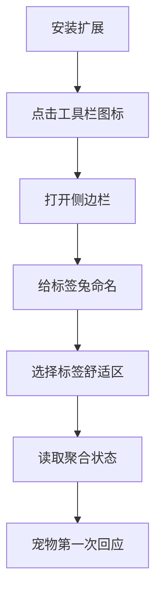
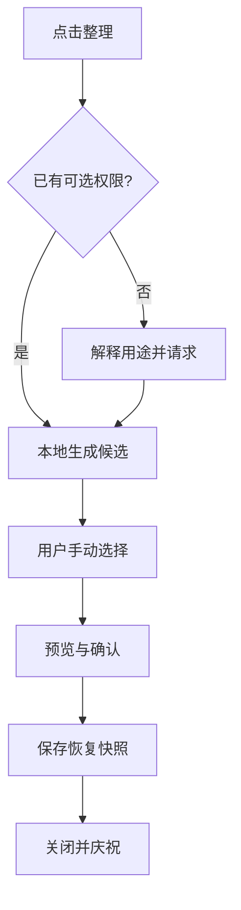

# Tabbit 产品需求文档（PRD）

- 文档版本：1.0
- 产品版本：MVP 0.1–0.3
- 首发平台：Chrome 114+ 桌面端
- 产品形态：Manifest V3 浏览器扩展
- 商业状态：个人开发验证，默认完全本地

## 1. 一句话定义

Tabbit 是一只住在浏览器侧边栏、也会在普通网页上散步的虚拟宠物。它把用户当前的标签页压力转化为看得见的角色状态，并通过轻量互动、温和提醒和庆祝反馈，帮助用户更愉快地整理浏览空间。

## 2. 问题与机会

### 2.1 用户问题

典型用户并不是不知道如何关闭标签页，而是：

- 每个页面“稍后可能有用”，关闭有心理成本；
- 普通标签管理器像管理工具，打开它本身就是一项任务；
- 强硬的效率工具带来羞耻或压力，很快被卸载；
- 用户感受不到一次小整理的即时回报；
- 浏览工作跨研究、开发、聊天和娱乐，简单的数量阈值并不公平。

### 2.2 产品机会

将“标签管理”改写成“照顾一个角色”：

- 标签页状态天然能驱动角色表情和动画；
- 每次整理都能产生即时视觉反馈；
- 角色成长带来长期留存，但不必设计成重度游戏；
- 只使用聚合信息即可成立，能够以隐私为差异点。

### 2.3 与传统工具的区别

| 传统标签管理器 | Tabbit |
| --- | --- |
| 目标是更快地找、关、分组标签 | 目标是建立温和的整理习惯 |
| 首屏是列表、计数和操作 | 首屏是角色与一句反馈 |
| 完成任务后没有情绪回报 | 角色庆祝、获得 XP 和收藏品 |
| 容易变成复杂工作台 | 限制功能密度，保持陪伴感 |
| 往往需要 URL、标题和历史权限 | MVP 只读取非敏感标签元数据 |

## 3. 目标用户

### Persona A：技术研究型多标签用户（核心）

- 一次打开 30–150 个文档、GitHub、日志或模型页面；
- 会在多个任务间切换，标签长期保留；
- 重视隐私、资源占用和可解释性；
- 愿意尝试有趣但不幼稚的开发者工具。

### Persona B：学习与资料收集用户

- 为课程、论文和兴趣研究持续开标签；
- 容易“收藏了就不再看”；
- 喜欢养成、装饰和收集反馈。

### Persona C：创意与运营用户

- 同时处理社交媒体、素材、文档和后台；
- 浏览节奏短促、窗口多；
- 需要低干扰的节奏提醒，而不是强制阻断。

### 非目标用户（MVP）

- 需要企业级审计、跨设备团队管理或合规归档的组织；
- 期待自动理解网页正文并替用户决定关闭哪些页面的人；
- 移动端用户；
- 需要完整书签替代品的用户。

## 4. 产品原则与反原则

### 原则

1. 角色状态必须可解释：用户能知道“为什么它现在忙”。
2. 行为反馈必须即时：关键事件后 2 秒内可见。
3. 正向强化优先：奖励自愿整理，不惩罚浏览或娱乐。
4. 用户可以调节阈值：20 个标签对不同人意义不同。
5. 低权限起步：只有某功能真正需要时才请求可选权限。

### 反原则

- 宠物不会死亡、生病、离家出走或通过负罪感逼迫用户。
- 不把“标签少”定义为“生产力高”。
- 不默认弹通知、不播放声音、不覆盖网页内容。
- 不偷偷采集域名、URL、标题、搜索词或页面正文。
- 不为了游戏化制造无限签到、付费倒计时和红点。

## 5. 目标与成功指标

### 5.1 MVP 目标

- 验证用户是否愿意为了看宠物状态而每周主动打开侧边栏；
- 验证宠物反馈是否能促成小规模、自愿的标签整理；
- 验证完全本地、低权限是否足以提供有趣体验。

### 5.2 北极星指标

**每周有意义互动用户数（WMIU）**：一周内至少完成 2 次不同类型的有意义互动，包括主动整理、查看状态或领取成长反馈。

### 5.3 辅助指标

| 指标 | MVP 目标 | 说明 |
| --- | ---: | --- |
| 安装后完成领养率 | ≥ 70% | 安装后 24 小时内完成命名和阈值设置 |
| D7 留存 | ≥ 25% | 个人工具冷启动阶段的方向性门槛 |
| 周均主动打开次数 | ≥ 3 | 不计自动打开 |
| 整理建议接受率 | ≥ 15% | 看到建议后进入整理流程 |
| 整理操作撤销/后悔率 | < 2% | 关闭动作必须保守 |
| 崩溃/未处理异常会话 | < 0.5% | 若无遥测，通过 beta 反馈统计 |
| 用户对权限疑虑反馈 | < 5% | 商店评论与访谈观察 |

MVP 默认无遥测，上述数据在小范围 beta 中通过自愿问卷或本地“导出匿名统计”获得。若未来增加遥测，必须单独 opt-in。

## 6. 核心概念模型

### 6.1 浏览负载

浏览负载是 0–100 的解释性指标，综合：

- 当前标签数量；
- 最近 10 分钟新建标签速度；
- 长时间未激活标签比例；
- 同时发声的标签数量。

它表示“当前浏览空间有多拥挤”，不是生产力或自律评分。

### 6.2 宠物状态

| 状态 | 触发 | 体验目的 |
| --- | --- | --- |
| 平静 `calm` | 负载 0–24 | 提供舒适、稳定反馈 |
| 好奇 `curious` | 负载 25–54 | 对正常探索给出活泼反应 |
| 忙碌 `busy` | 负载 55–79 | 温和提出整理建议 |
| 被埋住 `overwhelmed` | 负载 80–100 | 明确但不指责地求助 |
| 庆祝 `celebrating` | 完成小整理 | 形成即时正反馈 |
| 睡眠 `sleeping` | 安静时段且无交互 | 降低夜间刺激 |

### 6.3 成长系统

- `XP`：完成有意义的行为获得，用于升级；
- `树叶`：软货币，用于解锁背景、杯子、帽子等纯装饰；
- `收藏册`：记录已解锁的物品和小故事；
- 不连续签到也不会损失 XP 或物品；
- 每类奖励有每日上限，防止反复开关标签刷奖励。

## 7. MVP 范围

### P0：必须上线

#### F-01 安装与领养

用户故事：作为首次安装用户，我希望给宠物命名并选择舒适的标签数量，以便反馈符合自己的使用习惯。

需求：

- 首次打开显示 3 步领养流程：欢迎 → 命名 → 阈值选择；
- 名称 1–12 个可见字符，过滤控制字符；
- 提供三档预设：轻装 10/30、日常 20/50、重度 50/120；
- 可跳过并使用默认值；
- 完成后不再自动显示，可在设置中重新打开。

验收：

- 60 秒内可完成；刷新或重启不会丢失进度；
- 键盘和屏幕阅读器可完成全部步骤；
- 不要求注册、邮箱或网络访问。

#### F-02 实时宠物状态

用户故事：当我的标签页状态变化时，我希望宠物很快作出反应。

需求：

- 监听新建、关闭、激活标签以及浏览器启动；
- 每分钟兜底刷新，避免服务工作线程休眠造成状态漂移；
- 负载变化跨越阈值时切换状态；
- 展示一句原因，例如“刚才连续打开了 9 个标签”；
- 动画帧和文案按状态配置，不把规则散落在 UI 组件中。

验收：

- 正常事件后 2 秒内更新；
- 1000 标签环境计算在 100 ms 内完成（不含浏览器 API 时间）；
- 浏览器重启后状态能够重新计算；
- Side Panel 关闭时不持续渲染动画。

#### F-03 状态解释

用户故事：我希望知道宠物为什么这样，而不是面对一个神秘分数。

需求：

- 首屏显示“浏览负载”但明确标注不是效率评分；
- 点按说明后展示最多 3 个影响因素；
- 给出一个最小建议，例如“先整理 5 个看完的页面”；
- 建议可忽略，当天同类建议不重复弹出。

验收：因素与规则引擎输出一致，不包含 URL、标题或网站类别。

#### F-05 轻量成长反馈

用户故事：我希望自己的小整理能让宠物成长，但不想被签到绑架。

需求：

- 达成“负载从忙碌降到平静并保持 10 分钟”可奖励；
- 非窗口整体关闭情况下，3 分钟内减少 ≥5 个标签，触发 8 秒庆祝；
- 每日奖励上限，本地自然日计算；
- 升级时解锁一条文案或一件装饰占位物；
- 设置页提供重置成长数据，二次确认后执行。

验收：关闭整个窗口不错误刷奖励；浏览器同步/时间回拨不重复发奖；重置不影响用户阈值设置，除非用户选择“全部重置”。

#### F-06 设置与无障碍

- 调节舒适/拥挤阈值、静默时段、通知、减少动画；
- 可分别开启或关闭网页宠物与长期未访问标签提醒；
- 支持系统 `prefers-reduced-motion`；
- 色彩不作为唯一状态编码；
- 交互控件 44×44 CSS px 触达区域；
- 中文首发，所有文案进入 i18n 字典，避免组件硬编码。

#### F-06A 网页漫游宠物

- 领养完成后，小兔子在普通 HTTP/HTTPS 页面内随机移动，不读取页面正文、标题、网址、表单或输入；
- 左键点击触发逃跑，目标优先选择离指针较远的位置；
- 右键点击进入选中状态并打开控制菜单，可切换旧标签提醒、打开设置或关闭网页宠物；
- 根据当前心情展示挥手、跳跃、打盹、警觉与逃跑动作；
- 使用相邻目标点和动态过渡时长保持运动连贯，并优先避开候选路线上的可见文字；
- 设置页支持 30%–100% 透明度，交互时恢复完全可见；
- 存在长期未访问标签页时用页面气泡提醒，全局冷却至少 30 分钟；
- 减少动画开启、页面不可见或菜单展开时停止自动漫游；
- 使用 Shadow DOM 隔离样式和事件，不改变宿主页面布局。

### P1：Beta 前完成

#### F-07 安全整理助手（可选 `tabs` 权限）

- 用户主动点击后才解释并请求 `tabs` 权限；
- 本地展示长期未访问和重复 URL 候选；同域数量只作概览，不作为自动候选规则；
- 对同域多个未受保护标签提供按域名聚合为浏览器原生标签组的手动操作；
- 默认不勾选任何标签；固定、正在播放、当前活动、最近 10 分钟使用过和缺少活动时间的标签均受保护；
- 操作前显示“将关闭 N 个标签”及清单；
- 关闭前写入本地恢复快照，24 小时内一键恢复；
- 每次关闭均需预览并二次确认；
- 禁止后台自动关闭。

#### F-08 装饰收藏册

- 至少 6 个可解锁装饰；
- 装饰仅改变视觉，不影响负载和奖励；
- 资源全部随扩展打包，不从远程下载执行内容。

#### F-09 自定义 Codex 宠物（本地导入）

- 在设置页导入 Codex v1（1536×1872）或 v2（1536×2288）的 PNG/WebP 精灵图；
- 导入前验证格式、精确尺寸和 6 MB 体积上限；
- 素材仅保存在本机，不保存 Codex 宠物 ID、临时链接或任何远程凭据；
- 侧边栏和网页漫游共用同一素材；可一键删除素材并恢复默认小兔子。

### P2：上线后验证

- 新标签页微型栖息地（必须用户主动开启）；
- 跨设备同步非敏感设置与收藏；
- 多宠物与季节主题；
- 可分享的周报图片，只展示用户选择的聚合数字；
- Firefox 适配和 Edge 商店发布；
- 可选、明确授权的域名“食谱”玩法。

### 明确不进入 MVP

- AI 聊天、网页正文摘要和网站分类；
- 用户系统、云后端、排行榜、社交关系；
- 自动阻断网站、自动关闭标签、与标签管理无关的工作流工具；
- 付费订阅、广告和第三方埋点；
- 读取网页正文字符值或分析正文语义的宠物行为、`<all_urls>` 内容脚本；
- 浏览历史、书签、下载记录读取。

## 8. 关键用户流程

### 8.1 首次体验



完成页必须说明：“Tabbit 目前只知道你有多少标签、它们多久没被访问等聚合状态；它不知道你正在看什么。”

### 8.2 日常查看

1. 用户点击工具栏图标；
2. 侧边栏打开并展示上次状态；
3. 后台立即刷新，UI 过渡到最新状态；
4. 用户可查看原因、进入整理页或关闭面板；
5. 不要求用户完成任务才能离开。

### 8.3 整理助手（P1）



## 9. 业务规则

### 9.1 负载计算 v1

令：

- `T`：标签总数；
- `L`：用户舒适阈值，默认 20；
- `H`：用户拥挤阈值，默认 50；
- `R`：最近 10 分钟新建标签数；
- `S`：超过设定时长未激活的标签数；
- `A`：当前发声标签数。

归一化压力：

```text
tabPressure   = clamp((T - L/2) / max(1, H - L/2), 0, 1)
burstPressure = clamp(R / 12, 0, 1)
stalePressure = T == 0 ? 0 : clamp(S / T, 0, 1)
audioPressure = clamp(A / 3, 0, 1)

load = round(100 * (
  0.55 * tabPressure +
  0.25 * burstPressure +
  0.15 * stalePressure +
  0.05 * audioPressure
))
```

庆祝属于显式状态，优先级高于负载映射。睡眠由静默时段和近期交互共同判断。

### 9.2 防抖与状态稳定

- 状态升级（更忙）需连续两次采样达到阈值，或单次跨越 ≥15 分；
- 状态降级需持续 30 秒，避免开关一个标签导致角色来回闪烁；
- Side Panel 首次打开立即计算一次；
- 动画最短播放 1.5 秒，但不得阻止最新状态落盘。

### 9.3 奖励表

| 行为 | 奖励 | 限制 |
| --- | ---: | --- |
| 从忙碌恢复平静并保持 10 分钟 | 3 XP + 2 树叶 | 每日 2 次 |
| 非整窗关闭、3 分钟减少 ≥5 标签 | 1 XP | 每日 3 次 |
| 完成领养 | 5 XP + 初始装饰 | 一次性 |

不得为“打开更多标签”“连续签到”或“允许更多权限”发奖励。

## 10. 文案语气

### 推荐

- “今天这里有点热闹。”
- “刚才来了好多新页面，我先帮你记着节奏。”
- “要不要先送走 5 个已经看完的标签？”
- “呼，又看见桌面啦！”

### 禁止

- “你又分心了。”
- “效率只有 32 分。”
- “不整理我就要生病了。”
- “你浪费了 2 小时。”
- “必须连续签到才能保住奖励。”

## 11. 数据与隐私需求

MVP 本地保存：

- 宠物名称、等级、XP、装饰；
- 用户阈值、静默时段和无障碍设置；
- 最近 10 分钟标签创建时间戳；
- 每日奖励去重计数；
- 网页宠物与旧标签提醒开关、最近一次页面提醒时间。

基础宠物功能不采集：

- URL、网页标题、favicon、页面内容、输入内容；
- 浏览历史、书签、下载、Cookie、身份信息；
- IP、设备指纹或广告标识；
- 任何远程分析数据。

安全整理助手在用户主动授权 `tabs` 后，临时读取当前标签标题、URL 和状态以渲染候选清单；不上传、不写入诊断日志。网站聚合另需用户主动授权 `tabGroups`，仅按窗口对明确点击的网站执行原生分组。确认关闭后，仅保存所选标签的 URL、原窗口和索引作为本地恢复快照，最长 24 小时。

用户可在设置中导出本地 JSON、重置成长数据或删除全部数据。卸载后依赖浏览器清除扩展本地数据。

## 12. 验收总清单

- [ ] 所有 P0 用户故事通过产品验收。
- [ ] 默认权限只有 `storage`、`alarms`、`sidePanel`；`tabs` 仅作为可选权限按需请求。
- [ ] 没有显式 host permission 和远程代码；内容脚本仅匹配 HTTP/HTTPS，并且不读取宿主页面内容。
- [ ] 所有关闭标签动作都有预览、确认和恢复能力。
- [ ] 所有状态都有静态替代画面和文本标签。
- [ ] 负载规则、奖励去重、状态优先级有单元测试。
- [ ] 完成中文隐私政策、商店描述、权限解释和截图。
- [ ] 至少 10 位重度多标签用户试用一周。
- [ ] 收集“有趣程度、打扰程度、是否愿意保留”三个核心问题。

## 13. 发布判断

满足以下条件进入公开发布：

1. 至少 7/10 beta 用户愿意继续安装；
2. 没有自动关闭、状态丢失或持续高 CPU 的 P0/P1 缺陷；
3. 平均“打扰程度”不高于 2/5；
4. 至少一半 beta 用户在一周内主动完成两次有意义互动；
5. 权限与隐私说明可以用三句话清楚解释。
