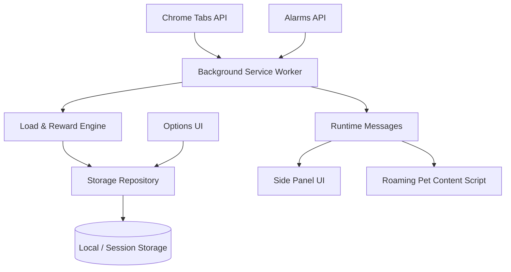

# Tabbit 技术设计文档

## 1. 技术决策摘要

| 项目 | 决策 | 原因 |
| --- | --- | --- |
| 扩展规范 | Manifest V3 | Chrome 首发与商店要求 |
| 工程框架 | WXT + React + TypeScript | 入口生成、跨浏览器构建和类型体验 |
| 主界面 | Chrome Side Panel | 跨标签导航保持存在，比 popup 更适合宠物 |
| 后台 | Extension Service Worker | 事件驱动；接受随时休眠和重建 |
| 存储 | `chrome.storage.local/session` | MVP 无后端；设置与短期事件分离 |
| 状态模型 | 纯函数规则引擎 | 可解释、可测试、不需要 AI |
| 内容脚本 | HTTP/HTTPS 页面上的隔离宠物图层 | 用 Shadow DOM 隔离样式与交互，不读取宿主页面内容 |
| 遥测 | 默认无 | 验证隐私优先定位 |
| 最低版本 | Chrome 114 | Side Panel API 基线 |

框架版本在首次依赖安装时通过 lockfile 固定；升级依赖必须单独 PR，并重新运行构建、单测和权限检查。

## 2. 系统架构



### 组件职责

- `background.ts`：注册浏览器事件、触发重算、调度 alarm、处理消息；
- `browser-snapshot.ts`：从浏览器 API 形成最小聚合快照；
- `load-engine.ts`：纯函数计算负载、状态和升级需求；
- `reward-engine.ts`（待实现）：奖励幂等、每日上限和升级；
- `storage.ts`：键名、默认值、读写和迁移；
- `sidepanel`：渲染状态、发出用户意图，不直接包含业务规则；
- `tabbit.content.tsx`：在普通网页创建 Shadow DOM 宠物图层，处理移动、情绪动作、点击和本地提醒；
- `roaming.ts`：纯函数计算漫游目标、逃跑位置和心情动作；
- `options`：设置、隐私和数据管理；
- `organizer`：仅在获得可选权限后读取 URL/标题并生成候选、预览、确认、恢复和按窗口标签组操作。

## 3. Service Worker 约束

扩展 Service Worker 会在空闲时被卸载，因此：

- 不在模块全局变量中保存权威业务状态；
- 每个事件处理器都能从存储恢复必要状态；
- 倒计时保存 `endsAt`，不依赖长期 `setInterval`；
- 周期工作使用 `chrome.alarms`；
- 事件处理器注册在模块顶层/初始化同步路径；
- 写操作支持重复执行，奖励以事件 ID 或时间桶去重；
- UI 打开时先显示缓存，再主动请求刷新。

## 4. 权限模型

### MVP 必需权限

| 权限 | 用途 | 不做什么 |
| --- | --- | --- |
| `storage` | 保存宠物、设置、奖励和本地会话 | 不同步到自建服务器 |
| `alarms` | 每分钟校准状态、完成专注 | 不用于频繁后台轮询网络 |
| `sidePanel` | 提供常驻侧边栏 UI | 不访问网页内容 |

`chrome.tabs` 命名空间本身可在 Service Worker 中使用；读取 URL、标题、favicon 等敏感字段才需要 `tabs` 或 host permission。MVP 只使用数量、活跃时间、声音、固定状态等非正文信息。

网页宠物通过静态内容脚本匹配 `http://*/*` 与 `https://*/*`。脚本挂载扩展自有的 Shadow DOM；为了选择不挡字的路线，只对少量候选路径坐标执行 caret/range 命中测试并读取字符渲染矩形，不读取字符值、`document.title`、`location.href`、表单、选择内容或输入事件，也不向远程服务发送数据。设置关闭后组件不渲染；浏览器内部页、扩展页及商店保护页不会运行该脚本。最终 Manifest 的 API 权限、host permissions 和内容脚本匹配范围都由 CI 白名单审计。

### 整理助手可选权限

`tabs` 仅在用户主动进入“安全整理助手”时请求；`tabGroups` 仅在用户点击网站“聚合”操作时请求。基础宠物功能不能依赖这些权限。拒绝或撤销权限后：

- 清理页面内存中的 URL/标题派生结果；
- 不继续运行候选分析；
- 保留聚合宠物状态；
- UI 显示重新授权入口，不反复弹窗。

### 禁止权限

MVP 不声明：`history`、`bookmarks`、`downloads`、`cookies`、`webRequest`、`scripting`、`<all_urls>` 或任意显式 host permission。允许的内容脚本范围仅为分别列出的 HTTP/HTTPS 匹配规则。

## 5. 事件模型

| 事件 | 行为 | 防护 |
| --- | --- | --- |
| `runtime.onInstalled` | 初始化 side panel、alarm、默认数据 | 不覆盖已有数据 |
| `runtime.onStartup` | 重算聚合状态 | 失败保留旧状态 |
| `tabs.onCreated` | 记录 10 分钟时间戳并重算 | session 中裁剪过期事件 |
| `tabs.onRemoved` | 重算、评估整理奖励 | `isWindowClosing` 不计整理奖励 |
| `tabs.onActivated` | 重算陈旧数量 | 需要防抖 |
| `alarms.onAlarm` | 每分钟校准；专注完成 | 按 alarm 名路由 |
| `storage.onChanged` | UI/后台同步设置变化 | 避免写回循环 |
| `runtime.onMessage` | UI 请求刷新、更新网页宠物偏好、打开设置 | 验证消息类型与 payload |

高频事件采用 250 ms trailing debounce 合并。alarm 是纠偏而非实时性的唯一来源。

## 6. 数据模型

### 6.1 持久状态 `storage.local`

```ts
interface PetStateV1 {
  schemaVersion: 1;
  name: string;
  mood: PetMood;
  loadScore: number;
  level: number;
  xp: number;
  leaves: number;
  staleTabCount?: number;
  lastUpdatedAt: number;
  focusEndsAt?: number;
  celebrationEndsAt?: number;
}

interface UserSettingsV1 {
  schemaVersion: 1;
  softTabLimit: number;
  hardTabLimit: number;
  staleAfterHours: number;
  reducedMotion: boolean;
  notificationsEnabled: boolean;
  roamingEnabled?: boolean;
  staleRemindersEnabled?: boolean;
  roamingOpacity?: number; // 30–100
  quietHoursStart: number;
  quietHoursEnd: number;
}
```

待实现：

```ts
interface RewardLedgerV1 {
  schemaVersion: 1;
  localDate: string; // YYYY-MM-DD in local timezone
  focusRewards: number;
  calmRecoveryRewards: number;
  cleanupRewards: number;
  processedEventIds: string[]; // bounded to latest 100
}

interface UnlockStateV1 {
  schemaVersion: 1;
  equippedDecorationId?: string;
  unlockedDecorationIds: string[];
}
```

### 6.2 临时状态 `storage.session`

- 最近 10 分钟标签创建时间戳；
- 防抖/事件合并的可恢复数据；
- P1 整理候选中的 URL/标题，操作结束即删除；
- UI 当前展开项等非必要状态。

### 6.3 P1 恢复快照

```ts
interface ClosedTabSnapshotV1 {
  schemaVersion: 1;
  createdAt: number;
  expiresAt: number;
  groups: Array<{
    windowOrder: number;
    tabs: Array<{ url: string; title?: string; pinned: boolean; index: number }>;
  }>;
}
```

快照保存在本地，24 小时自动删除；不保存表单状态、页面滚动位置或 Cookie。设置页允许立即删除。

## 7. 存储迁移

每个顶层对象包含 `schemaVersion`，迁移规则：

1. 读取原值；
2. 使用 Zod 检查已知版本；
3. 按 `v1 → v2 → …` 逐级纯函数迁移；
4. 写入新键前保留一次 `backup:<key>:<timestamp>`；
5. 成功后删除 7 天前备份；
6. 未知的未来版本不得覆盖，显示“版本不兼容”并允许导出。

当前骨架先采用默认值合并，正式 beta 前必须补 Zod 校验与迁移测试。

## 8. 规则引擎

### 8.1 设计要求

- 相同输入必须得到相同输出；
- 不读取系统时间，时间作为参数传入；
- 不直接访问 Chrome API 或 storage；
- 返回分数之外还应返回 `reasons[]`；
- 权重和阈值集中配置并带版本号；
- 规则调整时能使用录制的匿名聚合样本回归。

推荐输出：

```ts
interface LoadResult {
  score: number;
  mood: PetMood;
  reasons: Array<{
    code: 'TAB_COUNT' | 'OPEN_BURST' | 'STALE_RATIO' | 'AUDIO';
    contribution: number;
    messageKey: string;
  }>;
  ruleVersion: 'load-v1';
}
```

`reasons` 按贡献降序取前 3 个，UI 负责按 i18n key 渲染。

### 8.2 状态优先级

```text
celebrating > focused > sleeping > overwhelmed > busy > curious > calm
```

庆祝结束后重新计算，不直接回到旧 mood。专注结束也重新计算。

### 8.3 等级曲线

下一级所需 XP：`20 + (level - 1) * 10`。MVP 最高显示 20 级，达到上限后 XP 继续累计但不再升级；上线后依据实际使用频率调整，不设计指数型肝度。

## 9. 消息协议

所有跨入口消息使用可判别联合类型：

```ts
type RequestMessage =
  | { type: 'TABBIT_REFRESH' }
  | { type: 'FOCUS_START'; minutes: 15 | 25 | 45; requestId: string }
  | { type: 'FOCUS_CANCEL'; requestId: string }
  | { type: 'DATA_EXPORT'; requestId: string };

type PushMessage =
  | { type: 'TABBIT_STATE_UPDATED'; payload: PetStateV1 }
  | { type: 'FOCUS_COMPLETED'; eventId: string }
  | { type: 'ERROR'; code: string; recoverable: boolean };
```

后台必须验证来源和 payload；错误返回稳定 code，不把堆栈展示给普通用户。

## 10. 工程目录

```text
tabbit/
├── docs/
├── public/                     # 图标、角色 sprite、静态本地资源
├── src/
│   ├── domain/                 # 纯业务模型和规则
│   ├── entrypoints/
│   │   ├── background.ts
│   │   ├── sidepanel/
│   │   ├── options/
│   │   └── organizer/          # 可选权限整理页
│   ├── services/               # Chrome API、storage、通知适配
│   ├── components/             # 共享 UI（下一步抽取）
│   ├── i18n/                   # 类型化 zh-CN 文案目录与状态文案选择
│   └── styles/
├── tests/
├── wxt.config.ts
├── tsconfig.json
└── package.json
```

依赖方向只能是：`entrypoints/components → services + domain`，`services → domain`，`domain → 无浏览器依赖`。

## 11. 性能预算

| 项目 | 预算 |
| --- | ---: |
| Side Panel 首次可交互 | < 500 ms（典型设备，缓存资源） |
| UI 初始 JS gzip | < 180 KB |
| 角色静态资源总量 | < 1.5 MB |
| 状态纯计算 | < 100 ms / 1000 tabs |
| Side Panel 关闭时 CPU | 平均 < 0.2% |
| Side Panel 打开、空闲时 CPU | 平均 < 1% |
| 后台聚合写入 | 最多 1 次/秒，高频事件合并 |
| 本地长期数据 | < 2 MB（不含恢复快照） |

动画优先使用 transform/opacity，避免大面积 layout/paint；不可见时暂停动画。

## 12. 安全与隐私实现

- 不加载远程 JavaScript、WASM、字体或动画；
- 不使用 `eval`、`new Function` 或字符串定时器；
- CSP 保持 Manifest V3 默认严格策略；
- 所有用户名称用 React 文本节点渲染，不使用未净化 HTML；
- 导出数据前显示字段预览；
- 整理使用 URL 标准化比较时不记录 query 参数到日志；恢复快照只保留用户确认关闭的 URL、窗口和索引，最长 24 小时；
- 生产构建关闭详细调试日志；
- 依赖更新执行 audit、许可证检查和人工 review；
- 商店隐私说明与真实行为保持一致。

## 13. 错误处理与可观测性

MVP 不上传日志。提供本地环形诊断日志：

- 最多 200 条；
- 只包含时间、事件类型、错误 code、耗时和聚合数量；
- 不包含 URL、标题、宠物名称等自由文本；
- 用户主动点击“导出诊断”才生成 JSON；
- UI 错误边界允许重新加载侧边栏；
- 连续三次 API 失败时降低刷新频率并展示非阻塞提示。

## 14. 跨浏览器策略

### Chrome

首发完整 Side Panel 体验，最低 114。

### Edge

先验证 Chromium 兼容构建；若 Side Panel 行为存在差异，保留 popup 入口。商店包和隐私声明独立验证。

### Firefox

P2。使用 WXT 生成目标包，但 Firefox sidebar 与 MV3 生命周期、权限差异需单独适配；不得宣称“自动兼容”。

## 15. 代码质量门槛

- TypeScript strict，无未解释的 `any`；
- 业务规则覆盖率 ≥90%，整体语句覆盖率 ≥75%；
- 每个存储 schema 有合法、缺字段、损坏和迁移测试；
- 每个破坏性操作都有失败/部分成功处理；
- PR 必须通过 typecheck、unit test、build；
- manifest 权限变化必须由独立 reviewer 审查；
- 角色资源变更检查包体积和 reduced-motion 替代。

## 16. 官方技术参考

- [Chrome Extension Service Workers](https://developer.chrome.com/docs/extensions/develop/concepts/service-workers/)
- [Chrome Tabs API](https://developer.chrome.com/docs/extensions/reference/api/tabs)
- [Chrome Storage API](https://developer.chrome.com/docs/extensions/reference/api/storage)
- [Chrome Alarms API](https://developer.chrome.com/docs/extensions/reference/api/alarms)
- [Chrome Side Panel API](https://developer.chrome.com/docs/extensions/reference/api/sidePanel)
- [Declare Permissions](https://developer.chrome.com/docs/extensions/develop/concepts/declare-permissions)
- [Chrome Web Store Program Policies](https://developer.chrome.com/docs/webstore/program-policies/)
- [WXT Project Structure](https://wxt.dev/guide/essentials/project-structure.html)
